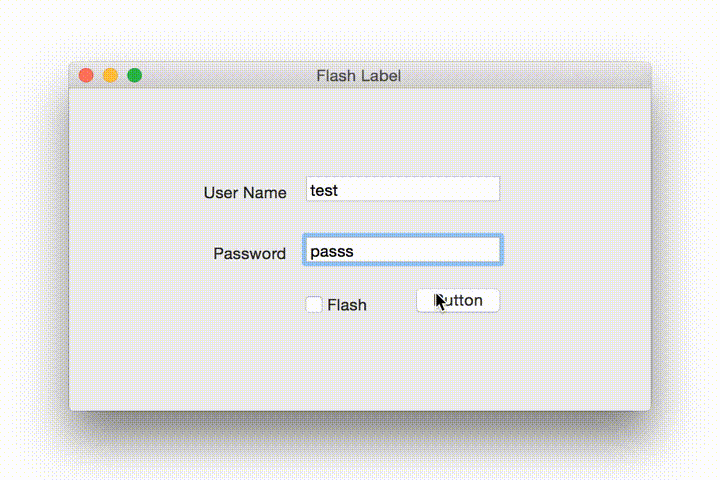

# FlashLabel

`FlashLabel` is simple and lightweight Timer based Label for Mac OSX implemented in Swift.


FlashLabel will fadeout the Label after a specific time.
It can be used for
- Alerts
- Notification
- Activity Progress

The best part about flash label is that it does not demand user interaction unlike alerts and notifications.

##Requirements
- Mac OS X 10.9
- Xcode 6

##Installation
####Direct
Drag `FlashLabel.swift` to your project. That is it!

####CocoaPods
[CocoaPods 0.36](http://cocoapods.org) adds supports for Swift and embedded frameworks.

To integrate FlashLabel into your Xcode project using CocoaPods, specify it in your `Podfile`:

```ruby
use_frameworks!

pod 'FlashLabel'
```

Then, run the following command:

```bash
$ pod install
```


##Usage
In Interface builder, drag a `Label` from Object Library and set `Custom Class` to `FlashLabel`
and 
```swift
flashLabel.show("Please enter a valid password", forDuration: 3.1, withFlash: false)
```

##License
`FlashLabel` is released under the MIT license. See LICENSE for details.


[](https://bitdeli.com/free "Bitdeli Badge")

